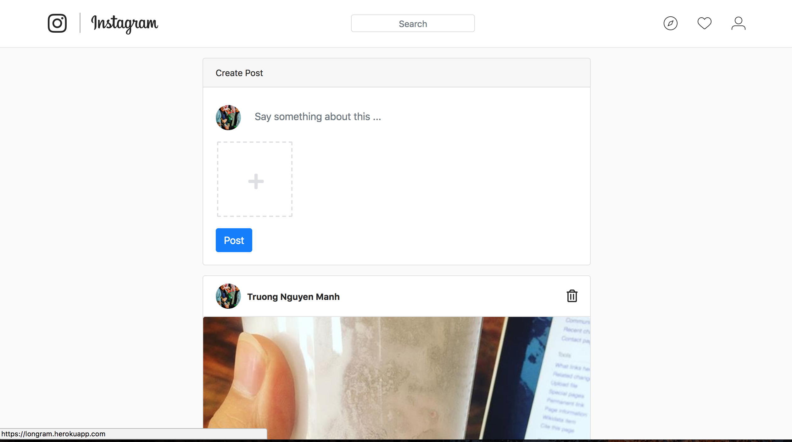
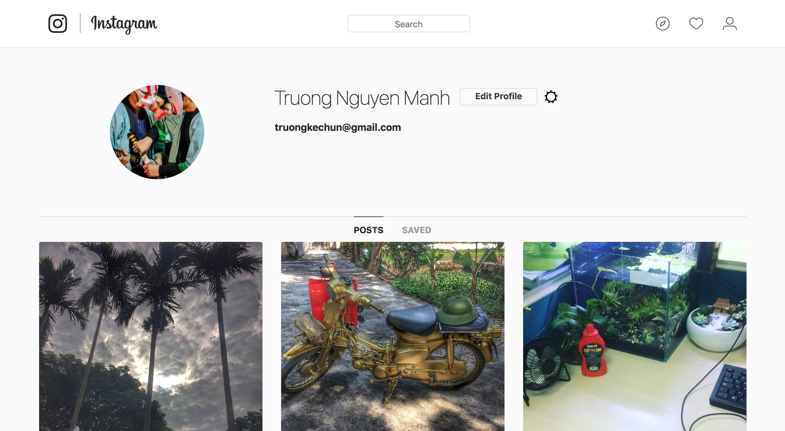
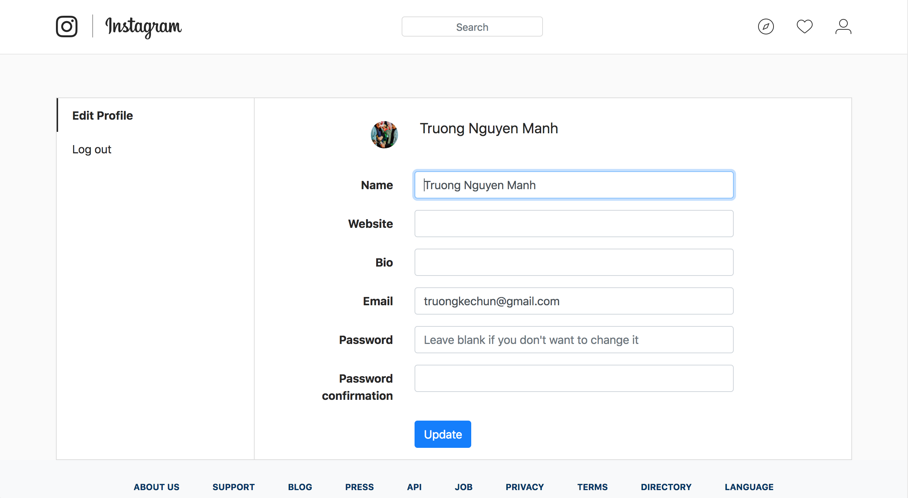

# How to build Instagram using Ruby on Rails

This is source code for my course: [How to build Instagram using Ruby on Rails](https://www.udemy.com/course/1648774/) 

## Demo
Here is a working live demo: https://longram.herokuapp.com/

## Site

### Landing Page
User can login using email/password or using social account.

### Home Page

### Post Detail Page

### My Page

### Profile Page

### Development
Want to contribute? Great!

To fix a bug or enhance an existing module, follow these steps:

- Fork the repo
- Create a new branch (`git checkout -b improve-feature`)
- Make the appropriate changes in the files
- Add changes to reflect the changes made
- Commit your changes (`git commit -am 'Improve feature'`)
- Push to the branch (`git push origin improve-feature`)
- Create a Pull Request

### Bug / Feature Request

If you find a bug, kindly open an issue [here](https://github.com/truongnmt/instagram-udemy/issues/new).

If you'd like to request a new function, feel free to do so by opening an issue [here](https://github.com/truongnmt/instagram-udemy/issues/new). Please include sample queries and their corresponding results.

## Built with
- Ruby 2.5
- Rails 5.1.6+
- jQuery - Ajax - jQuery simplifies HTML document traversing, event handling, animating, and Ajax interactions for rapid web development.
- [Bootstrap 4](http://getbootstrap.com/) - Extensive list of components and  Bundled Javascript plugins.
- Awesome [Gems](Gemfile)

## [License](LICENSE.md)

MIT © [Truong Nguyen](https://github.com/truongnmt)
